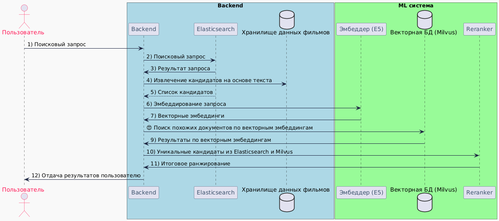

[**Датасет**](https://www.kaggle.com/datasets/grouplens/movielens-20m-dataset/data)

# Поиск и ранжирование

Система поиска и ранжирования в онлайн-кинотеатре теперь использует гибридный подход, сочетающий **текстовый поиск** с помощью **Elasticsearch**, **семантический поиск** с использованием модели **E5** для создания эмбеддингов, и **переранжирование** результатов с помощью модели **Reranker**. Это позволяет системе обеспечивать высокую точность и релевантность результатов, обрабатывая запросы как на уровне текста, так и на уровне семантики.

### Компоненты системы поиска:
1. **Elasticsearch** — отвечает за текстовый поиск по проиндексированным данным фильмов (название, жанры, описание). Возвращает список кандидатов на основе текстового соответствия с запросом.
2. **Эмбеддер (E5)** — модель, использующаяся для создания векторных представлений (эмбеддингов) для запросов и фильмов. **E5** (`intfloat/multilingual-e5-large`) используется для поиска по семантическому соответствию фильмов запросу.
3. **Milvus** — векторная база данных, которая хранит эмбеддинги фильмов и осуществляет поиск наиболее похожих фильмов на основе векторного представления запроса.
4. **Reranker (BERT)** — финальная модель для переранжирования списка кандидатов, полученных из **Elasticsearch** и **Milvus**. Модель `amberoad/bert-multilingual-passage-reranking-msmarco` оценивает релевантность каждого фильма относительно запроса пользователя.

### Процесс работы системы:
1. **Поисковый запрос** от пользователя поступает в **Elasticsearch**, который выполняет текстовый поиск и возвращает список кандидатов на основе ключевых слов (название, жанры, описание).
2. **Эмбеддер (E5)** преобразует запрос в векторное представление, после чего происходит поиск семантически близких фильмов в **Milvus**, возвращая кандидатов, релевантных на уровне смысла.
3. **Backend** объединяет уникальные результаты из **Elasticsearch** и **Milvus** в общий список кандидатов.
4. **Reranker** получает объединённый список и выполняет финальное ранжирование, оценивая релевантность каждого фильма относительно запроса с учетом контекста и семантики. Модель `amberoad/bert-multilingual-passage-reranking-msmarco` оптимизирована для многоязычных запросов.
5. **Backend** возвращает пользователю отсортированный список фильмов по итоговой релевантности.

### Преимущества подхода:
- **Гибридный поиск**: система использует как текстовую релевантность через **Elasticsearch**, так и семантическую релевантность через эмбеддинги, что позволяет получить более точные и релевантные результаты для сложных запросов.
- **Переранжирование с Reranker**: модель **BERT** на этапе переранжирования улучшает финальные результаты, учитывая контекст и глубинные связи между запросом и фильмами.
- **Многоязычная поддержка**: как модель **E5**, так и **Reranker** поддерживают многоязычные тексты, что делает систему гибкой для обработки запросов на разных языках.

### Итоговая архитектура системы поиска:
1. **Elasticsearch** для текстового поиска и извлечения кандидатов на основе ключевых слов.
2. **E5** для семантического поиска через создание эмбеддингов запросов и фильмов.
3. **Milvus** для поиска фильмов по эмбеддингам.
4. **Reranker (BERT)** для финального ранжирования списка кандидатов с учетом контекста.

Эта система обеспечивает точные и релевантные рекомендации, комбинируя как текстовые, так и семантические характеристики запроса и фильмов.

# Рекомендации

### Описание системы рекомендаций с гибридным подходом (Content-based и User-based Collaborative filtering)

Эта система рекомендаций для онлайн-кинотеатра использует **гибридный подход**, комбинируя два метода: **Content-based фильтрацию** и **User-based Collaborative filtering**. Этот подход позволяет учитывать как особенности контента фильмов (жанры, актеры, описание), так и предпочтения пользователей на основе схожести с другими пользователями.

### Компоненты системы:

1. **Content-based фильтрация с использованием CatBoost**:
   - **Content-based фильтрация** использует данные о характеристиках фильмов (такие как **жанры**, **актеры**, **описание**) для предсказания, какие фильмы понравятся пользователю.
   - **CatBoost** — это алгоритм градиентного бустинга, который обучается на данных о взаимодействиях пользователей с фильмами. Модель использует признаки фильмов и взаимодействия пользователей для предсказания того, насколько вероятно, что конкретный фильм понравится конкретному пользователю.
   - **Признаки** для каждого фильма включают:
     - **Genres** (жанры, закодированные как one-hot encoding).
     - **Actors** (актеры, представленные как категориальные признаки).
     - **Description** (описание фильма, которое можно преобразовать в числовые признаки с помощью TF-IDF или других методов).
   - Модель **CatBoost** предсказывает вероятность того, что фильм понравится пользователю на основе его предпочтений, выраженных через взаимодействия с фильмами.

2. **User-based Collaborative Filtering с использованием ALS**:
   - **User-based Collaborative filtering** использует поведение других пользователей для рекомендаций. Модель обучается на данных о том, какие фильмы пользователи оценивали и смотрели.
   - **Алгоритм ALS** (Alternating Least Squares) факторизует матрицу взаимодействий пользователей с фильмами, чтобы создать векторы пользователей и фильмов в едином скрытом пространстве. Эти векторы позволяют системе находить **схожих пользователей**.
   - **User-based алгоритмы** основаны на поиске пользователей с похожими вкусами. Система находит тех, чьи интересы максимально схожи, и рекомендует пользователю фильмы, которые понравились его "соседям" (похожим пользователям).
   - Например, если **User A** и **User B** смотрели одинаковые фильмы и дали им схожие оценки, система рекомендует **User A** фильмы, которые смотрел **User B**, но которые **User A** еще не видел.

### Решение проблемы Cold Start:
   - **Cold Start** — это проблема, когда система не имеет данных о новом пользователе (или новом фильме), что затрудняет предоставление рекомендаций. Чтобы решить эту проблему, используется подход **Popularity-based рекомендаций**.
   - При регистрации нового пользователя система не знает его предпочтений, поэтому она может рекомендовать **популярные фильмы**, которые часто смотрят или оценивают другие пользователи.
   - Как только у пользователя появляются первые взаимодействия (например, просмотренные фильмы или оценки), система начинает использовать данные для **Content-based** и **Collaborative filtering** рекомендаций.

### Как работает гибридная система:

1. **Content-based предсказания**:
   - Система получает информацию о пользователе (например, его взаимодействия с фильмами) и строит профиль на основе характеристик фильмов, которые он уже смотрел или оценил.
   - Модель **CatBoost** предсказывает вероятность того, что конкретные фильмы понравятся пользователю на основе жанров, актеров и описаний.
   
2. **Collaborative filtering предсказания**:
   - **ALS** находит пользователей с похожими предпочтениями и предлагает фильмы, которые они оценивали, но которые текущий пользователь еще не видел.
   - Предсказания основаны на схожести с "соседями", у которых схожие оценки фильмов.

### Комбинирование прогнозов в гибридной системе:

- **Гибридизация** происходит путем комбинирования результатов от обеих моделей — **CatBoost** (Content-based) и **ALS** (Collaborative filtering).
- Комбинированный рейтинг фильма для пользователя может быть рассчитан как **взвешенная сумма** предсказаний от обеих моделей:
  $$
  \[
  \text{Final\_score} = \alpha \times \text{CatBoost\_score} + (1 - \alpha) \times \text{ALS\_score}
  \]
  $$
  где:
  - **CatBoost\_score** — это предсказанная вероятность или оценка от модели CatBoost, основанная на характеристиках фильма.
  - **ALS\_score** — это предсказание от модели ALS, основанное на коллаборативной фильтрации.
  - **\(\alpha\)** — это коэффициент, который контролирует, какой метод имеет больший вес в финальной оценке. Например, если больше доверия отдается коллаборативной фильтрации, можно выбрать \(\alpha = 0.4\), и наоборот.

### Шаги работы системы:
1. **Новые пользователи**:
   - Система рекомендует **популярные фильмы** на основе рейтингов и количества просмотров другими пользователями (Popularity-based рекомендация).
   
2. **Сбор взаимодействий**:
   - По мере того как пользователь начинает взаимодействовать с системой (смотрит фильмы, оставляет оценки), система собирает данные о его предпочтениях.

3. **Content-based рекомендации**:
   - Модель **CatBoost** анализирует взаимодействия пользователя и делает предсказания на основе характеристик фильмов, которые пользователь уже смотрел или оценивал.

4. **Collaborative filtering рекомендации**:
   - Модель **ALS** находит пользователей с похожими предпочтениями и рекомендует фильмы на основе того, что смотрели эти пользователи.

5. **Комбинирование результатов**:
   - Система комбинирует предсказания от **Content-based** и **Collaborative filtering** моделей, создавая финальный список рекомендаций для пользователя.
   - Например, если фильм имеет высокий рейтинг по обоим подходам, он получит приоритет в списке рекомендаций.
